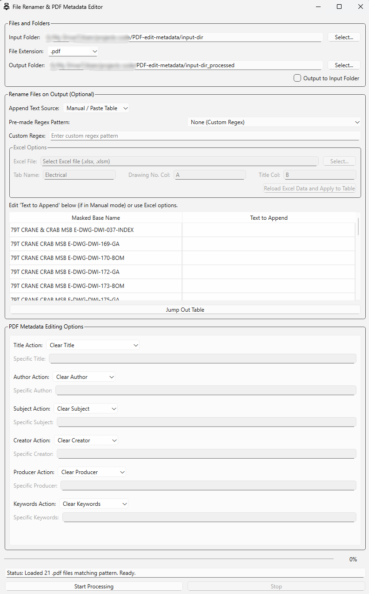

### Core Concepts & Initial Setup

Before starting any task, you need to configure the basic file handling:

1.  **Input Folder:** Click `Select...` and choose the folder containing the files you want to process.
2.  **File Extension:** Select or type the extension of the files you are targeting (e.g., `.pdf`, `.dwg`). This filters the files shown and enables relevant options (like PDF metadata editing).
3.  **Output Folder:**
    *   **Default:** By default, the application suggests an output folder named `[Input Folder]_processed`. Processed files will be saved here, leaving your original files untouched in the Input Folder. You can click `Select...` to choose a different location.
    *   **Output to Input Folder:** If you check this box, the application will modify/overwrite the files *directly in the Input Folder*. **Use this with caution**, as it modifies your original files. It's generally recommended to output to a separate folder first to verify the results.

Once an Input Folder and File Extension are set, the application will scan for matching files and populate the table in the "Rename Files on Output" section (if any files match the current regex pattern).

---

### Use Case 1: Clear Metadata of all PDFs in a Folder

This task uses the "PDF Metadata Editing Options" section, which is only active if `.pdf` is selected as the File Extension 

1.  **Setup:**
    *   Set the **Input Folder** to the directory containing your PDFs.
    *   Set the **File Extension** to `.pdf`.
    *   Configure the **Output Folder** (either leave the default `_processed` folder, select a new one, or check "Output to Input Folder" if you are sure you want to modify originals).
2.  **Configure Metadata Actions:**
    *   Go to the "PDF Metadata Editing Options" section.
    *   For **Title Action**, select `Clear Title` from the dropdown.
    *   For **Author Action**, select `Clear Author`.
    *   For **Subject Action**, select `Clear Subject`.
    *   For **Creator Action**, select `Clear Creator`.
    *   For **Producer Action**, select `Clear Producer`.
    *   For **Keywords Action**, select `Clear Keywords`.
    *   Leave the "Specific..." fields blank; they are disabled when a "Clear" action is selected.
3.  **Ignore Renaming (Optional):** If you *only* want to clear metadata and *not* rename the files, you can ignore the "Rename Files on Output" section. The files will be processed, metadata cleared, and saved with their original names to the output location. If you *also* want to rename them, configure the renaming section as described in Use Cases 2 or 3.
4.  **Start Processing:** Click the `Start Processing` button. The application will read each PDF, clear the specified metadata fields, and save the modified PDF to the output location. Monitor the progress bar and status line.

---

### Use Case 2: Rename Files According to Regex

This task uses the "Rename Files on Output" section to extract a specific part of the filename based on a pattern (Regular Expression).

**What is Regex?**
A Regular Expression (Regex) is a sequence of characters that defines a search pattern. It's a powerful way to find and extract text that matches specific rules (e.g., finding text that looks like a date, an email address, or, in this case, a specific drawing number format).

*   Example: `\d{3}` is a simple regex pattern that matches exactly three digits (0-9). `[A-Z]{3}` matches exactly three uppercase letters.

**Steps:**

1.  **Setup:** Configure **Input Folder**, **File Extension**, and **Output Folder**.
2.  **Configure Renaming:**
    *   Ensure the "Rename Files on Output" section is visible (it appears after selecting a valid Input Folder and Extension).
    *   **Choose a Pattern:**
        *   **Using Presets:** Select a format like `A-XXX-YYY-999` from the "Pre-made Regex Pattern" dropdown. The corresponding regex pattern will automatically appear in the "Custom Regex" field below it.
        *   **Using Custom Regex:** Select `None (Custom Regex)` from the dropdown. Enter your specific regex pattern directly into the "Custom Regex" field. For example, if your drawing numbers are always `PROJ-NNNN-TYPE`, you might use `PROJ-\d{4}-[A-Z]+`. https://platform.text.com/tools/regex-builder may help.
    *   **Verify Masked Names:** Look at the table below. The "Masked Base Name" column shows the part of each original filename that matches your regex pattern.
        *   If a file doesn't match the pattern, its "Masked Base Name" will be empty, and it will be excluded from processing.
        *   If the "Custom Regex" field shows an error in the status bar, your pattern is invalid. Correct it.
3.  **Configure Appending (Optional):** For this use case (renaming *only* based on regex), ensure the "Text to Append" column in the table is empty. You can leave the "Append Text Source" as "Manual / Paste Table". The final output filename will be `[Masked Base Name].[Original Extension]`.
4.  **Start Processing:** Click `Start Processing`. The application will create copies of the files (or modify originals if "Output to Input Folder" is checked), renaming them using the extracted "Masked Base Name".

---

### Use Case 3: Append Revision Numbers or Drawing Titles to Filenames

This task also uses the "Rename Files on Output" section, specifically focusing on populating the "Text to Append" column. This text will be added *after* the base filename (which might have been modified by regex as per Use Case 2).

**Method A: Manual / Paste Table**

Use this if you have the text to append ready (e.g., in a list or spreadsheet column) or want to type it manually.

1.  **Setup:** Configure **Input Folder**, **File Extension**, and **Output Folder**.
2.  **Configure Regex (Optional):** If you want to clean up the base filename *before* appending, set up the Regex pattern as described in Use Case 2. If you want to append to the *original* filename (minus extension), ensure the "Masked Base Name" column shows the desired base name (e.g., by using "None (Custom Regex)" or a regex that matches the full base).
3.  **Configure Appending:**
    *   In the "Rename Files on Output" section, select `Manual / Paste Table` from the "Append Text Source" dropdown.
    *   The "Text to Append" column in the table becomes editable.
    *   **Enter Text:**
        *   **Manually:** Click into a cell in the "Text to Append" column and type the desired text (e.g., `REV A`, `SCHEMATIC DIAGRAM`).
        *   **Pasting:** Copy a list of text items (one per line) from another source (like Notepad or an Excel column). Click on the *first cell* in the "Text to Append" column where you want the pasting to start, then press `Ctrl+V`. The copied items will paste downwards into the subsequent rows.
        *   **Deleting:** Select cells in the "Text to Append" column and press the `Delete` key to clear them.
4.  **Verify:** Check the "Masked Base Name" and "Text to Append" columns to ensure they look correct. The final filename will be `[Masked Base Name] [Text to Append].[Original Extension]` (note the space automatically inserted).
5.  **Start Processing:** Click `Start Processing`.

**Method B: Append from Excel**

Use this if you have an Excel sheet mapping drawing numbers (or other identifiers found in the filenames) to the text you want to append (like titles or revisions).

1.  **Setup:** Configure **Input Folder**, **File Extension**, and **Output Folder**.
2.  **Configure Regex (Optional):** As in Method A, set up Regex first if you need to modify the base filename.
3.  **Configure Appending:**
    *   Select `Append from Excel` from the "Append Text Source" dropdown. The "Excel Options" group becomes active, and the "Text to Append" column becomes read-only.
    *   **Select Excel File:** Click `Select...` next to "Excel File" and choose your `.xlsx` or `.xlsm` file.
    *   **Enter Tab Name:** Type the exact name of the worksheet (tab) containing your mapping data into the "Tab Name" field.
    *   **Enter Columns:**
        *   **Drawing No. Col:** Enter the Excel column letter (e.g., `A`) that contains the identifier (like the drawing number) which *also appears* within the filenames listed in the table's "Masked Base Name" column (or the original filename if no masking is done).
        *   **Title Col:** Enter the Excel column letter (e.g., `B`) that contains the text you want to *append* (the drawing title, revision number, etc.).
    *   **Load & Apply:** Click the `Reload Excel Data and Apply to Table` button.
4.  **Verify:**
    *   The application reads the specified Excel data.
    *   It looks for matches between the values in your "Drawing No. Col" (Excel) and the text within the filenames shown in the table.
    *   For each match found, it takes the corresponding value from your "Title Col" (Excel) and populates the "Text to Append" column in the table.
    *   Check the status line for messages about how many mappings were loaded and applied. Check the "Text to Append" column to see the results.
5.  **Start Processing:** Click `Start Processing`. The final filename will be `[Masked Base Name] [Text to Append].[Original Extension]`.

---

### Running the Process

*   **Start Processing:** Once configured, click this button to begin. The button will disable, and the `Stop` button will enable.
*   **Progress Bar:** Shows the overall progress of the operation.
*   **Status Line:** Provides real-time feedback on the current action, errors, or completion status.
*   **Stop:** Click this button to interrupt the process safely. The application will finish the current file it's working on (if possible) and then stop.
*   **Completion:** A message box will appear summarising the results (how many files processed, how many potential renames, successes/failures).

Remember to always back up important data before running batch processing tools, especially when using the "Output to Input Folder" option.